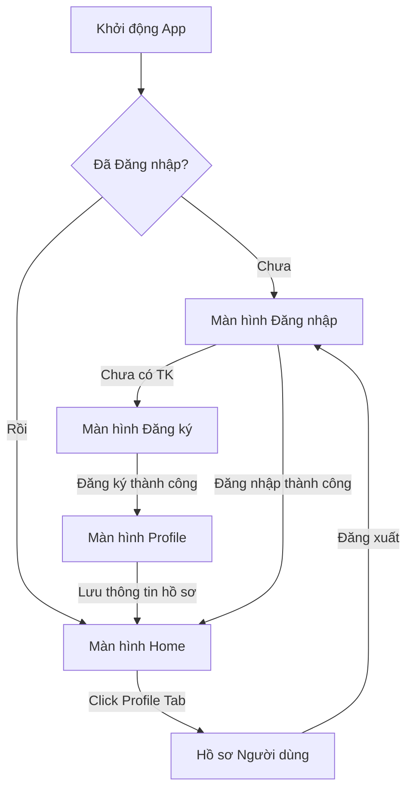
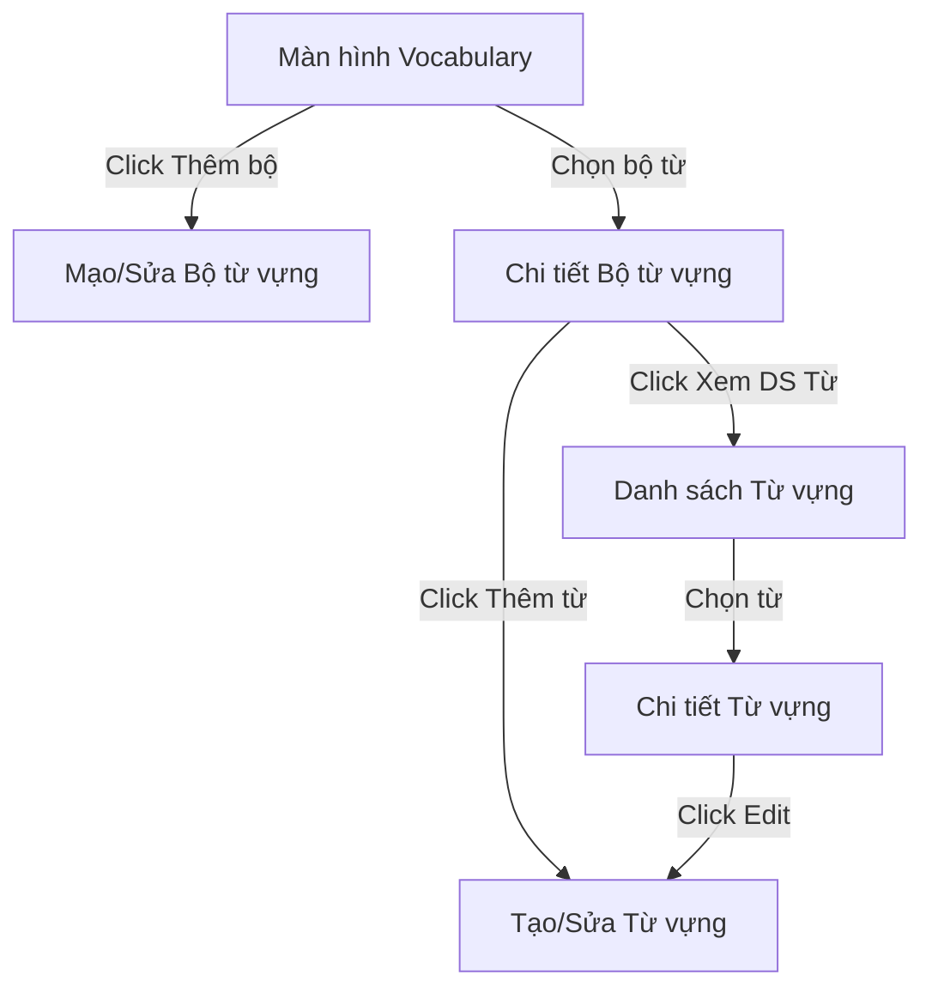
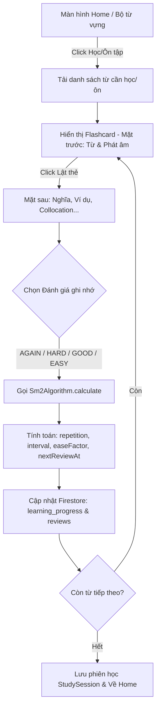

# Tóm Tắt Dự Án MaxLish App (Ứng dụng Học Từ Vựng Tiếng Anh)

Dưới đây là tài liệu phân tích chi tiết về dự án **MaxLish-App** dựa trên khảo sát cấu trúc thư mục, công nghệ, cấu trúc dữ liệu và logic nghiệp vụ hiện tại của hệ thống.

---

## 1. Tổng Quan Dự Án

**MaxLish App** là ứng dụng di động hỗ trợ học từ vựng tiếng Anh hiệu quả dựa trên các phương pháp khoa học tiên tiến:
*   **Flashcard**: Học từ vựng qua thẻ ghi nhớ trực quan hai mặt.
*   **Spaced Repetition (Lặp lại ngắt quãng)**: Sử dụng thuật toán SuperMemo-2 (SM-2) để tối ưu hóa thời gian ôn tập từ vựng tùy theo khả năng ghi nhớ của người học.
*   **Context-based learning**: Học từ vựng gắn liền với ngữ cảnh thực tế (ví dụ câu, collocation, từ liên quan).

---

## 2. Công Nghệ Sử Dụng (Technology Stack)

Hệ thống được xây dựng trên các công nghệ Android hiện đại và tối ưu:
*   **Ngôn ngữ lập trình**: [Kotlin](https://kotlinlang.org/) (JVM target 11).
*   **UI Framework**: **Jetpack Compose** kết hợp với **Material Design 3** cung cấp giao diện hiện đại, mượt mà và linh hoạt.
*   **Điều hướng (Navigation)**: **Navigation Compose** (`androidx.navigation:navigation-compose`) giúp quản lý luồng màn hình bằng mã khai báo.
*   **Xử lý bất đồng bộ & Luồng**: **Kotlin Coroutines** (`kotlinx-coroutines-android`) phối hợp với **Lifecycle & LiveData KTX** giúp xử lý các tác vụ nền hiệu quả.
*   **Cơ sở dữ liệu & Xác thực (Backend)**:
    *   **Firebase Authentication**: Quản lý đăng ký, đăng nhập (hỗ trợ Email/Password và Google Sign-In thông qua `play-services-auth`).
    *   **Cloud Firestore**: Cơ sở dữ liệu NoSQL thời gian thực để lưu trữ thông tin người dùng, từ vựng, bộ từ vựng, lịch sử ôn tập và tiến độ học tập.
*   **Tác vụ chạy nền**: **WorkManager** (`androidx.work:work-runtime-ktx`) để xử lý các tác vụ chạy nền định kỳ (ví dụ: gửi thông báo nhắc nhở học tập).

---

## 3. Kiến Trúc & Cấu Trúc Thư Mục (Project Architecture)

Dự án được tổ chức cực kỳ khoa học theo kiến trúc **Clean Architecture** kết hợp với mô hình **MVVM (Model-View-ViewModel)**. Đây là cấu trúc **chuẩn mực** giúp hệ thống dễ bảo trì, mở rộng và kiểm thử độc lập.

```
app/src/main/java/com/example/maxlish/
│
├── MainActivity.kt               # Entry point chính của ứng dụng Android
│
├── data/                         # LỚP DỮ LIỆU (Data Layer)
│   ├── model/                    # Các thực thể dữ liệu (Data Entities) & Thuật toán SM-2
│   │   ├── User.kt               # Thông tin tài khoản người dùng
│   │   ├── VocabularySet.kt      # Bộ từ vựng (ví dụ: IELTS, TOEIC...)
│   │   ├── VocabularyWord.kt     # Từ vựng chi tiết (từ, phát âm, nghĩa, ví dụ, collocation...)
│   │   ├── LearningProgress.kt   # Tiến độ học của từng từ (SM-2 metrics: repetition, interval, easeFactor...)
│   │   ├── Review.kt             # Lịch sử chi tiết mỗi lượt review từ vựng
│   │   ├── ReviewQuality.kt      # Định nghĩa chất lượng ôn tập (AGAIN, HARD, GOOD, EASY)
│   │   ├── Sm2Algorithm.kt       # Cài đặt thuật toán SuperMemo-2 (SM-2)
│   │   ├── StudySession.kt       # Thống kê phiên học (thời gian học, số từ đúng/sai)
│   │   └── AppNotification.kt    # Cấu trúc thông báo trong ứng dụng
│   │
│   ├── repository/               # Repository Pattern - Giao tiếp với nguồn dữ liệu (Firestore)
│   │   ├── AuthRepository.kt / FirebaseAuthRepository.kt
│   │   ├── VocabularyRepository.kt / FirebaseVocabularyRepository.kt
│   │   ├── LearningRepository.kt / FirebaseLearningRepository.kt
│   │   └── ProgressRepository.kt / FirebaseProgressRepository.kt
│   │
│   ├── seed/                     # Seed Data
│   │   └── SeedData.kt           # Tạo dữ liệu mẫu phong phú lên Firestore phục vụ Testing/Development
│   │
│   └── worker/                   # WorkManager Worker
│
└── ui/                           # LỚP GIAO DIỆN (Presentation Layer)
    ├── navigation/
    │   └── AppNavGraph.kt        # Khai báo tất cả các Route và cấu trúc điều hướng toàn bộ app
    │
    └── screen/                   # Các màn hình chứa UI (Compose) và ViewModel tương ứng
        ├── login/                # Màn hình Đăng nhập
        ├── register/             # Màn hình Đăng ký
        ├── profile/              # Màn hình Thiết lập Hồ sơ cá nhân (Mục tiêu học, Cấp độ)
        ├── home/                 # Màn hình Trang chủ (Dashboard, Tổng quan, Phím tắt học tập)
        ├── vocabulary/           # Quản lý Bộ từ vựng & Từ vựng (Thêm, Sửa, Xóa bộ từ và từ vựng)
        ├── learning/             # Giao diện Học Flashcard & Đánh giá Spaced Repetition (SM-2)
        └── progress/             # Biểu đồ & Thống kê tiến độ (Số từ đã học, Streak...)
```

### Nhận Xét Về Độ "Chuẩn" Của Dự Án:
*   **Điểm cộng xuất sắc**:
    1.  **Repository Pattern**: Tách biệt rõ ràng interface (`AuthRepository`, `VocabularyRepository`...) và bản cài đặt thực tế (`FirebaseAuthRepository`, `FirebaseVocabularyRepository`...). Cách làm này giúp dễ dàng viết Unit Test (bằng cách Mock Repository) hoặc chuyển đổi nguồn dữ liệu (ví dụ: lưu Local Room Database song song với Firebase) mà không phải sửa code ở UI/ViewModel.
    2.  **Định nghĩa Route rõ ràng**: File `AppNavGraph.kt` sử dụng `AppDestinations` tập trung, truyền đối số (`setId`, `wordId`, `mode`) qua URL-like patterns rất chuyên nghiệp.
    3.  **Tách ViewModel Factory**: Khai báo và khởi tạo ViewModel thủ công bằng Factory truyền các Repository trực tiếp giúp đảm bảo tính rõ ràng về dependency.
    4.  **Cơ sở dữ liệu mẫu (Seed Data)**: Class `SeedData.kt` thiết kế cực kỳ kỹ lưỡng, hỗ trợ đổ dữ liệu có cấu trúc hợp lý (liên kết khóa ngoại giữa users, sets, words, progress, reviews, sessions) giúp quá trình kiểm thử giao diện mượt mà và trực quan.

---

## 4. Các Luồng Tính Năng Chính (Feature Flows)

### 4.1. Luồng Xác Thực & Thiết Lập Hồ Sơ (Auth & Profile Flow)

*   **Chi tiết**: Người dùng đăng nhập qua email/password hoặc liên kết Google. Nếu là người dùng mới, hệ thống dẫn hướng tới màn hình Profile để chọn cấp độ hiện tại (B1, B2...) và mục tiêu học tập (IELTS, TOEIC, Giao tiếp...) trước khi truy cập Dashboard chính.

---

### 4.2. Luồng Quản Lý Từ Vựng (Vocabulary Management Flow)

*   **Chi tiết**: Người dùng có thể tự tạo bộ từ vựng cá nhân, thiết lập tag, độ công khai. Trong mỗi bộ từ, người dùng thêm các thẻ từ vựng với đầy đủ thuộc tính: phát âm, nghĩa tiếng Việt, câu ví dụ thực tế, collocation thông dụng, từ đồng nghĩa/trái nghĩa giúp học theo ngữ cảnh sâu sắc.

---

### 4.3. Luồng Học & Ôn Tập Lặp Lại Ngắt Quãng (Learning Engine & SM-2 Flow)
Đây là **trọng tâm** logic của ứng dụng:


*   **Thuật toán SM-2 Hoạt Động Như Thế Nào trong Code (`Sm2Algorithm.kt`)?**
    *   Mức chất lượng ôn tập của người dùng được ánh xạ sang điểm số từ `2` đến `5`:
        *   `AGAIN` $\rightarrow$ 2 (Không nhớ từ)
        *   `HARD` $\rightarrow$ 3 (Nhớ cực kỳ khó khăn)
        *   `GOOD` $\rightarrow$ 4 (Nhớ sau một chút phân vân)
        *   `EASY` $\rightarrow$ 5 (Nhớ ngay lập tức một cách hoàn hảo)
    *   **Ease Factor (Hệ số dễ - EF)** được cập nhật liên tục:
        $$EF_{new} = EF_{prev} + (0.1 - (5 - q) \times (0.08 + (5 - q) \times 0.02))$$
        *(Đảm bảo EF tối thiểu là 1.3)*
    *   **Khoảng cách ngày ôn tập tiếp theo (Interval)**:
        *   Nếu người học không nhớ từ ($q < 3$ hay `AGAIN`): Khoảng cách đặt về `1` ngày, chu kỳ lặp lại reset về `0`.
        *   Nếu người học nhớ từ ($q \ge 3$):
            *   Lần lặp đầu tiên (`repetition = 1`): Ôn tập lại sau **1 ngày**.
            *   Lần lặp thứ hai (`repetition = 2`): Ôn tập lại sau **6 ngày**.
            *   Lần lặp lớn hơn 2: Ôn tập lại sau **$\lceil Interval_{prev} \times EF \rceil$ ngày**.
    *   Thời gian ôn tập tiếp theo được tính bằng: `System.currentTimeMillis() + interval * 24h` để nhắc nhở người học chuẩn xác.

---

### 4.4. Luồng Thống Kê & Theo Dõi Tiến Độ (Progress Tracking Flow)
*   Mỗi khi hoàn thành một phiên học (`LEARN`), hệ thống ghi nhận một thực thể `StudySession` lên Firestore chứa:
    *   Số từ đã học (`reviewedWords`)
    *   Số câu trả lời đúng (`correctAnswers`)
    *   Số câu trả lời sai (`wrongAnswers`)
    *   Thời gian học bằng phút (`durationMinutes`)
*   Màn hình **Progress** (`ProgressScreen` & `ProgressViewModel`) lấy dữ liệu từ `FirebaseProgressRepository` và `FirebaseLearningRepository` để:
    *   Hiển thị Streak (Số ngày học liên tiếp) của User.
    *   Tính tỷ lệ phần trăm chính xác trung bình.
    *   Vẽ biểu đồ tần suất học tập hằng ngày và ước lượng trình độ hiện tại của người dùng.

---

## 5. Kết Luận & Đánh Giá Tổng Thể

*   **Tính chuẩn hóa**: Dự án được xây dựng rất bài bản, sạch sẽ và tuân thủ nghiêm ngặt các nguyên lý phát triển Android hiện đại (Modern Android Development - MAD). Kiến trúc tách biệt rõ ràng giữa Business Logic và Giao diện giúp giảm thiểu tối đa rủi ro xảy ra lỗi dây chuyền khi sửa code.
*   **Trải nghiệm học tập**: Thuật toán SM-2 được tích hợp đầy đủ và chính xác dưới dạng module độc lập, là điểm cốt lõi tạo nên giá trị học tập lặp lại ngắt quãng thực thụ tương tự như các app lớn như Anki hay Memrise.
*   **Khả năng mở rộng**: Dễ dàng tích hợp thêm các module phụ trợ (như Mini-game luyện tập từ vựng, Import bộ từ vựng từ file CSV/Excel như yêu cầu phi chức năng) nhờ hệ thống Repository Pattern vững chãi.
